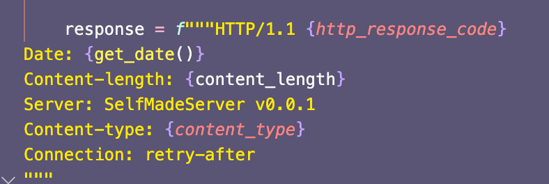
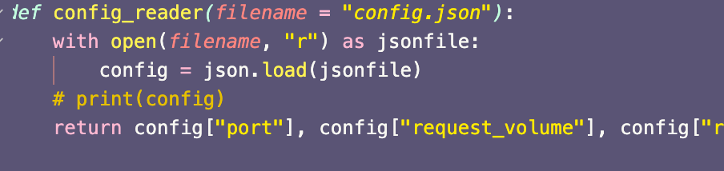
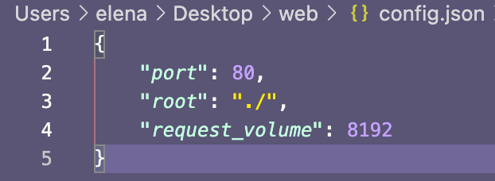
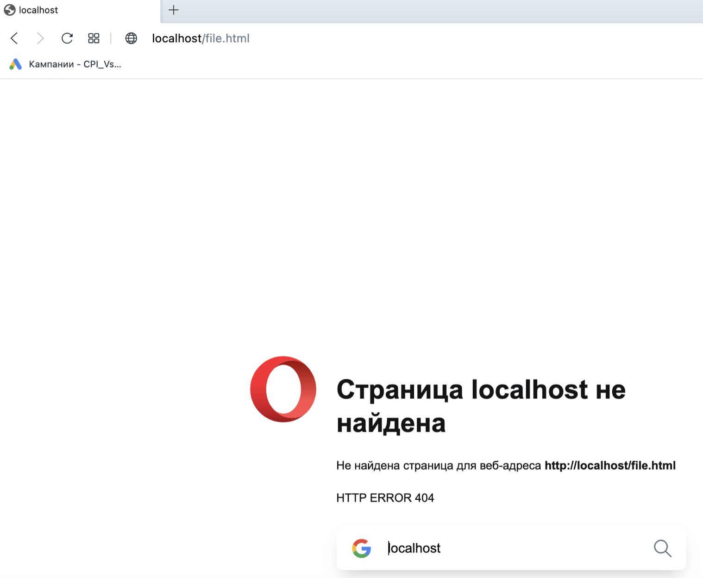
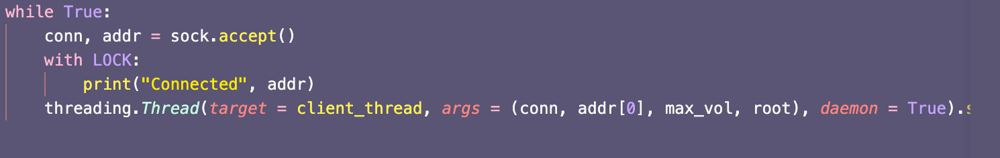
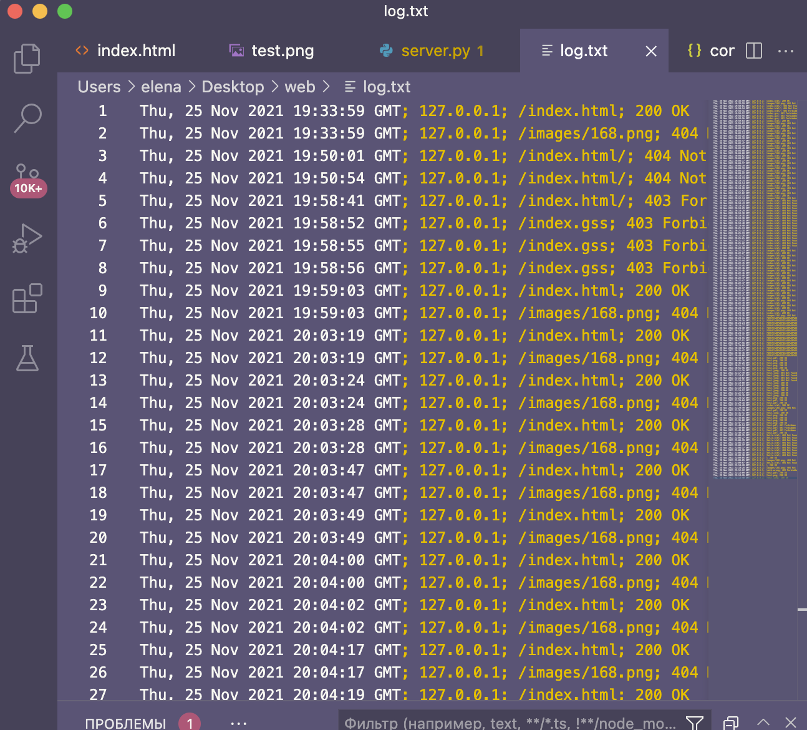
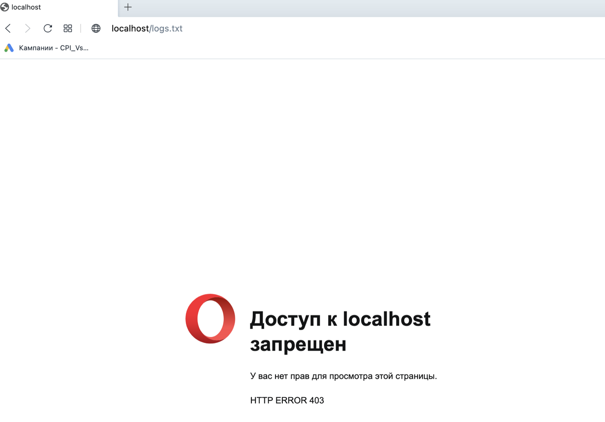
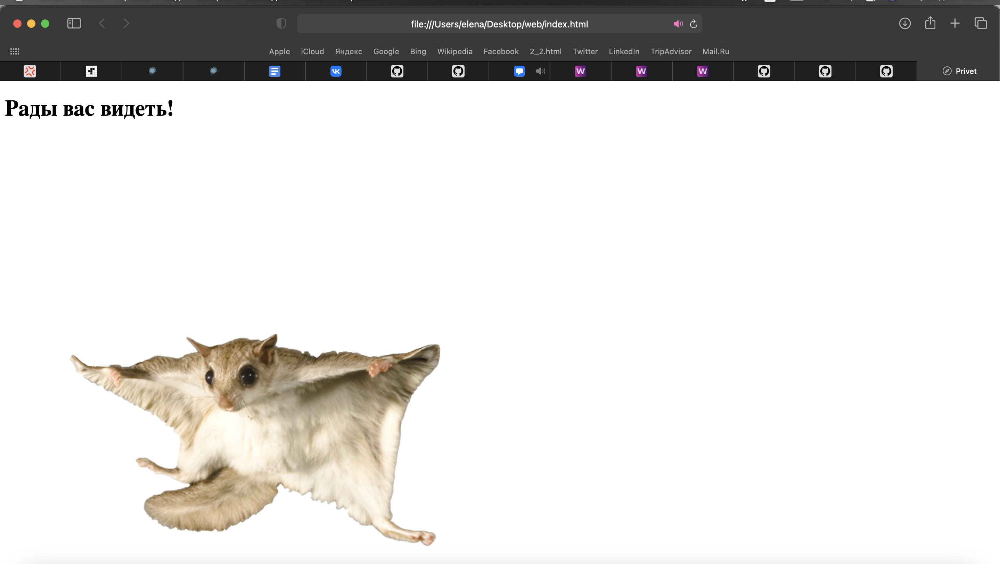
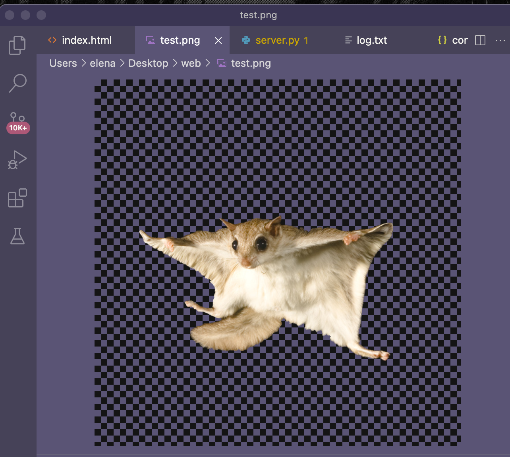

# Низкоуровневая работа с веб
# Цель работы
Освоить основные навыки обращения c Web из программы на Python, средства парсинга веб-страниц, соответствующие библиотеки.
# Дополнительные задания
+ При ответе вашего сервера посылайте некоторые основные заголовки:
+ + Date
+ + Content-type
+ + Server
+ + Content-length
+ + Connection: close.

Создайте файл настроек вашего веб-сервера, в котором можно задать прослушиваемый порт, рабочую директорию, максимальный объем запроса в байтах. Можете добавить собственные настройки по желанию. Файл настроек в формате JSON

Если файл не найден, сервер передает в сокет специальный код ошибки - 404.

Ошибка 404 так как такого файла нет 6. Сервер должен работать в многопоточном режиме.

Сервер должен вести логи в следующем формате: Дата запроса. IP-адрес клиента, имя запрошенного файла, код ошибки. В файле log.txt в корне сервера

Добавьте возможность запрашивать только определенные типы файлов (.html, .css, .js и так далее). При запросе неразрешенного типа, верните ошибку 403.

Реализуйте поддержку бинарных типов данных, в частночти, картинок.

